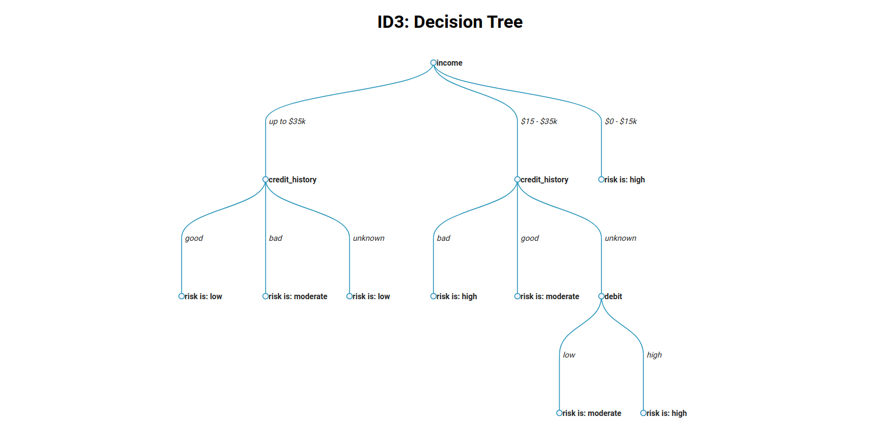

# ID3 - Decision Tree

## What is ID3?

"In simple words, a decision tree is a structure that contains nodes and edges and is built from a dataset. Each node is either used to make a decision (known as decision node) or represent an outcome (known as leaf node)." (Yaser Sakkaf, 2020)

## About

This project was created during the Artificial Intelligence discipline, with the collaboration of <a href="https://github.com/Yuri-Ribeiro">Yuri Ribeiro</a>, my course colleague.  
The frontend of this application was created using React.js and some libraries to show the tree.

## How can you test it

If you want to test the application on your machine, just perform a 'clone' or simply download this repository. Then just run the following codes:

`yarn` 

then  

`yarn start`

You can also use `npm` instead of `yarn`

A web page will open in your browser with the decision tree. In this project we have 3 databases already defined (`bank.json`, `tennis.json` and `bank_error.json`). If you want to add new databases just be aware that the class property needs to be the last value declared in the json.
